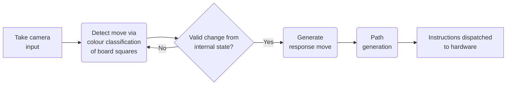
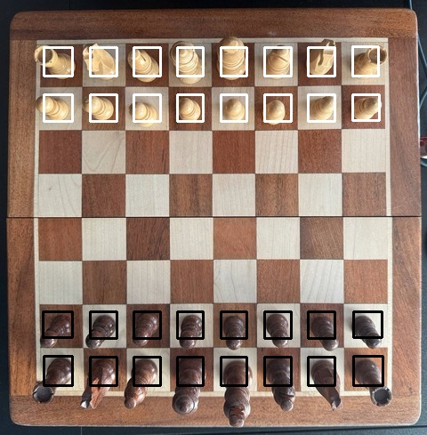
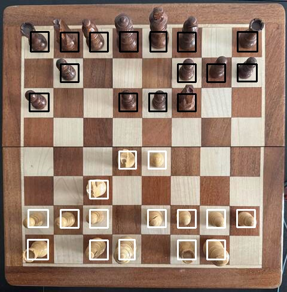
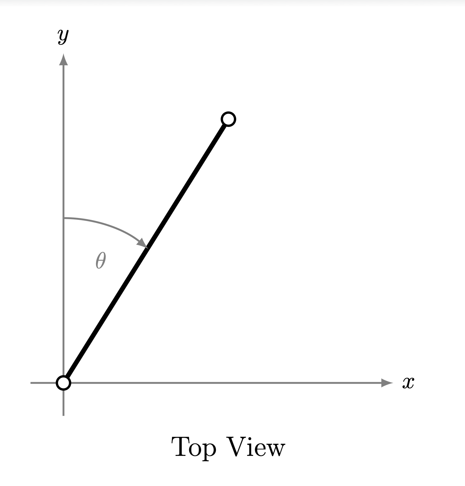
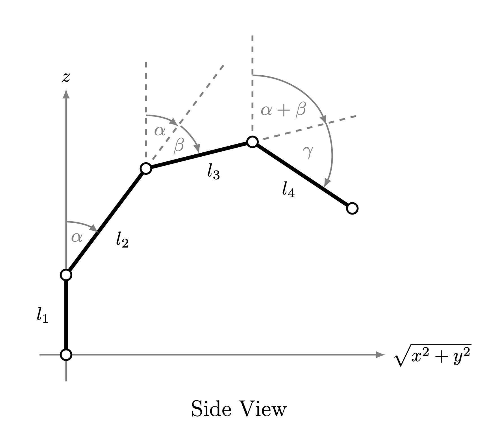

# Chess Arm

This is a 3 DOF robotic arm that can play chess. It makes use of classical computer vision techniques to detect a chessboard and changes in its state, streaming of processed video over Websockets, inter-process communication with a chess engine for move generation, and coordination with the Arduino-controlled robot over a serial interface using a geometric solution for inverse kinematics and linear interpolation of joint angles using a cubic speed profile for a smooth trajectory.

The following diagram depicts the decision process of the control software run on the Raspberry Pi.



After installation, the provided test suite can be run with:

```bash
cargo test 2> /dev/null
# Or for testing with coverage:
cargo install llvm-cov
cargo llvm-cov --html --open 2> /dev/null
```

### Contents

1. [A Preview](#a-preview)
2. [Build and Usage Instructions](#build-and-usage-instructions)
3. [Watching the Robot's Perspective](#watching-the-robots-perspective)
4. [An Explanation of the Computer Vision](#an-explanation-of-the-computer-vision)
5. [Inverse Kinematics Formula Derivation](#inverse-kinematics-formula-derivation)
6. [Speed Profile Related Formulae Derivations](#speed-profile-related-formulae-derivations)

### A Preview

The images below show the board as seen by the robot, with detected white and black pieces boxed by squares of their colour.

On the left is the board viewed in its starting position from the black perspective, whilst the position on the right shows the pieces further into the game from the white perspective.

<p align="center">
  
  
</p>

The following short video shows the robot playing a real game:

// todo

### Build and Usage Instructions

This program has been tested on the Raspberry Pi Zero 2W with a supported camera running Raspberry Pi OS Lite and Rust v1.95.0.

First a chess engine (for move generation), GStreamer (for using the camera) and OpenCV (a computer vision library) need to be installed:
```bash
sudo apt install stockfish gstreamer1.0-libcamera gstreamer1.0-plugins-base \
  libopencv-dev --no-install-recommends
```

To build the binary:
```bash
git clone https://github.com/a-manthan-t/chess_arm.git && cd chess_arm
cargo build --release
```

Running the program requires 7 arguments:

```bash
target/release/chess_arm <device> <engine_path> <l1> <l2> <l3> <max_speed> <square_width>
```

1. `<device>`: The device path to the robot arm connected over USB (`/dev/...`).
2. `<engine_path>`: The path to the chess engine's program.
3. `<l1> <l2> <l3>`: The length of each segment of the arm starting from the base. The first segment should rotate around the Z axis (and its length should be measured from the level of the chessboard to the level of the second joint) and the remaining two should rotate about the X axis.
4. `<max_speed>`: The maximum speed the robot should travel at in units per second, where units is the same as what the segment lengths were measured in.
5. `<square_width>`: The width of a square on the chessboard, again measured in the same units as above. The base joint of the robot arm should be positioned two square widths behind the start of the first rank on the board.

The program will block until a connection is received from a viewer (see the next section). It will also start another game once one is finished until the program is aborted.

For proper camera, ensure the board is centred in the camera and takes up the whole field of view. It should also be evenly lit with minimal shadows.

The program in the `arduino` directory is a sample for the hardware used in the demonstration. A copy of this robot needs to have an arm with 4 servos (3 for the arm motions rotating as specified above and 1 for the gripper), read 12 bytes at a time from serial input and convert them into 3 floats (angles), and use those angles to set the first three motors. If the angles are all infinity/negative infinity the gripper should close/open up respectively. 

### Watching the Robot's Perspective

The `stream_client` directory contains a HTML file that allows the user to connect to and monitor the robot over websockets.

When opened in the browser, enter the Raspberry Pi's IP address/hostname on the local network.

### An Explanation of the Computer Vision

Using footage captured from the Raspberry Pi's camera (positioned top down above the board and aligned with the board), the robot needs to understand which pieces are on which square to make a decision. Since each chess move in a given position uniquely changes the layout of the pieces, we can simplify the problem (after enforcing the auto-queen rule - the queen is the desired promotion in most situations anyways) by only needing to identify the colour of the piece in each square (instead of needing to identify the type as well) and compare with an internal representation of the board state to deduce the move played by the user.

During configuration, the board must be segmented into the 64 squares and the perspective of the robot (i.e. if the robot is playing with the white or black pieces) needs to be identified.

For this, a still image of the board is converted to greyscale and slightly blurred to reduce the noise in the image. Then the Canny edge detection algorithm followed by the Hough transform to extract all straight lines in the image, which includes the grid lines on the chessboard. Each line is represented in polar coordinates $(\rho, \theta)$, where $\rho$ is the perpendicular distance to the line from the origin and $\theta$ is the angle of the perpendicular from the origin.

The lines are then classified as vertical or horizontal (or ignored if they are neither) based on the angle $\theta$ (it needs to be roughly 0 or 180 degrees for vertical lines and 90 degrees for horizontal lines). The intersections between the lines are then calculated which are the corners of squares on the chessboard. After filtering repeated intersection points, there should be either 81 or 121 points left (9x9 points on an 8x8 chessboard, 11x11 if the board has a border).

The points are then sorted by their $y$ coordinate to split them into rows, and each row of 9 or 11 points are sorted by their $x$ coordinate to obtain an ordered list of points from the top left of the image to the bottom right. In the case of 121 points, the border is stripped away so only 81 points remain. Each point is then combined with the point to the bottom right of it to create a rectangle representing a square on the board (although shrunk a bit so the edges of the square are ignored). The rectangles are generated so that the squares are stored in `h8`-`a1` order.

When processing a frame from the camera (converted to HSV instead of BGR colour format), a bitboard (64 bit integer) for each colour is used to represent the 64 squares. Techniques related to bitboards are also used elsewhere to classify moves generated by the chess engine.

Each rectangle is used to mask the square from the frame, and the mean and standard deviation of the colour in each square is calculated. If the standard deviation of the colour value is greater than a chosen threshold, the square is classified as occupied and the mean of the hue, saturation, and value are compared with a separate threshold to determine if the piece is white or black. The corresponding bitboard then has 1 added to it and is shifted left by 1 bit, so after every square is visited the 0th bit corresponds to the `a1` square and the 63rd to `h8` (the standard format for bitboards used by chess engines).

The possible moves from the internal representation of the board state are then enumerated and the camera generated bitboards are compared to determine if the new state provides a valid continuation of the game.

### Inverse Kinematics Formula Derivation

The final angle each servo motor of the arm needs to be set to must be calculated from the destination coordinates of the end effector.

Below are images depicting the skeleton of the arm from the top and side - the lengths of each arm segment are $l_{1-3}$. The first motor needs to be set to angle $\theta$, and the remaining two to $\alpha$ and $\beta$. Furthermore, $(x, y, z)$ are the destination coordinates.

<p align="center">
  
  
</p>

Using simple trigonometry, the first motor needs to be set to $\theta = \arctan\frac{x}{y}$ from the top view.

In the side view, the horizontal axis represents the horizontal distance to the coordinate, which from Pythagoras' theorem is $\sqrt{x^2+y^2}$.

Making use of corresponding angles, the angle above $\beta$ is $\alpha$. This gives the angles of each arm segment from the vertical to be $\alpha$ and $\alpha + \beta$.

Using simple trigonometry again the total horizontal distance is:

$$\sqrt{x^2 + y^2} = l_2\sin\alpha + l_3\sin(\alpha + \beta)$$

and the total vertical distance is:

$$z = l_1 + l_2\cos\alpha + l_3\cos(\alpha + \beta)$$

Since $h = z - l_1$, it can also be expressed as a rearrangement of the above formula. $R^2$ can now be calculated (using Pythagoras' theorem) from the horizontal distance of the end effector and its height above the second joint:

$$R^2=\sqrt{x^2 + y^2}^2 + (z - l_1)^2 = x^2 + y^2 + h^2$$

Notice now the triangle formed by $R$, $l_2$, and $l_3$. By applying the law of cosines.

$$R^2 = l_2^2 + l_3^2 - 2l_2l_3\cos\gamma$$

Since $\beta = 180 - \gamma$, $\cos\beta=-\cos\gamma$ (a standard identity), so after substitution:

$$\cos\beta=\frac{R^2-l_2^2-l_3^2}{2l_2l_3}\implies\beta=\arccos\left(\frac{R^2-l_2^2-l_3^2}{2l_2l_3}\right)$$

There is also the right angled triangle formed between $R$, $h$, and the perpendicular above. Using simple trigonometry once more:

$$\alpha + \delta = \arccos\frac{h}{R}$$

Using the law of sines:

$$\frac{\sin\delta}{l_3}=\frac{\sin\gamma}{R}\implies\delta=\arcsin\frac{l_3\sin(180 - \beta)}{R}=\arcsin\frac{l_3\sin\beta}{R}$$

Subtracting this from $\alpha + \delta$ above gives $\alpha$.

A slight rearrangement of these formulae is used in the final code.

### Speed Profile Related Formulae Derivations

The control software updates the robot's positions at regular intervals, but for a smooth travel the arm should accelerate and decelerate on its path between checkpoints to prevent sudden movements at the start and end of the journey that could damage motors and knock over pieces.

A formula is then needed to convert between the fraction of the journey's duration that has elapsed and the expected fraction the arm should have travelled along its path, given the start and end speeds ($v_0$ and $v_1$ respectively) and a desired model of the arm's speed over time.

For the model, a cubic bezier curve has been chosen (conventionally used for drawing smooth curves in graphics), which requires start and end points (the start and end speeds) as well as two control points (which have been chosen as the start and end speeds as well since the formulas simplify nicely).

Let $v$ be the speed of the arm's end effector at time $t$. Using the cubic bezier formula:

$$v(t) = (1 - t)^3 v_0 + 3(1 - t)^2 t v_0 + 3(1 - t) t^2 v_1 + t^3 v_1 = v_0 + (3t^2 - 2t^3)(v_1 - v_0)$$

Note that $t$ ranges from $0$ to $1$, which corresponds to the fraction of the journey's duration that has elapsed. Since distance (which we will let be $s$) is defined as the integral of speed with respect to time:

$$s(t) = \int_0^t v(x) dx = \left[v_0x + \left(x^3 - \frac{1}{2}x^4\right)(v_1 - v_0)\right]_0^t = v_0t + (v_1 - v_0)\left(t^3 - \frac{1}{2}t^4\right)$$

This needs to be scaled according to the total path length, which can be calculated by substituting $t = 1$:

$$s(1) = v_0 + (v_1 - v_0)\left(1 - \frac{1}{2}\right) = v_0 + \frac{v_1 - v_0}{2} = \frac{v_0 + v_1}{2}$$

Overall, the formula for the fraction $f$ of the path that has been travelled at time $t$ is:

$$f(t) = \frac{s(t)}{s(1)} = \frac{v_0t + (v_1 - v_0)\left(t^3 - \frac{1}{2}t^4\right)}{(v_0 + v_1) / 2}$$

$f(t)$ can then be used in the linear interpolation formula alongside the start and end angles $\alpha_0$ and $\alpha_1$ of each motor calculated using the inverse kinematics formulae to find the intermediate angle $\alpha(t)$:

$$\alpha(t) = \alpha_0 (1 - f(t)) + \alpha_1 f(t)$$

Using the mean value theorem, the average speed of the end effector is the integral of the speed over the whole interval divided by the size of the interval (which is $1$), so the average speed is simply $s(1) = (v_0 + v_1) / 2$, which turns out to be the average of the speeds at either checkpoint.
