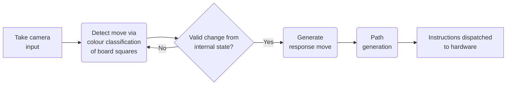

# Chess Arm

This is a 4 DOF robotic arm that can play chess. It makes use of classical computer vision techniques to detect a chessboard and changes in its state, streaming of processed video over Websockets, inter-process communication with a chess engine for move generation, and coordination with the Arduino-controlled robot over a serial interface using a geometric solution for inverse kinematics and coordinate interpolation using a cubic speed profile for a smooth trajectory.

The following diagram depicts the decision process of the control software run on the Raspberry Pi.



After installation, the provided test suite can be run with:

```bash
cargo test 2> /dev/null
```

### Contents

1. [A Preview](#a-preview)
2. [Build and Usage Instructions](#build-and-usage-instructions)
3. [Watching the Robot's Perspective](#watching-the-robots-perspective)
4. [An Explanation of the Computer Vision](#an-explanation-of-the-computer-vision)
5. [Inverse Kinematics Formula Derivation](#inverse-kinematics-formula-derivation)
6. [Speed Profile Related Formulae Derivations](#speed-profile-related-formulae-derivations)

### A Preview

The images below show the board as seen by the robot, with detected white and black pieces boxed by squares of their colour.

On the left is the board viewed in its starting position from the black perspective, whilst the position on the right shows the pieces further into the game from the white perspective.


The following short video shows the robot playing a real game:

// todo

### Build and Usage Instructions

This program has been tested on the Raspberry Pi Zero 2W with a supported camera running Raspberry Pi OS Lite and Rust v1.95.0.

First a chess engine (for move generation), GStreamer (for using the camera) and OpenCV (a computer vision library) need to be installed:
```bash
sudo apt install stockfish gstreamer1.0-libcamera gstreamer1.0-plugins-base \
  libopencv-dev --no-install-recommends
```

To build the binary:
```bash
git clone https://github.com/a-manthan-t/chess_arm.git && cd chess_arm
cargo build --release
```

Running the program requires 8 arguments:

```bash
target/release/chess_arm <device> <engine_path> <l1> <l2> <l3> <l4> <max_speed> <square_width>
```

1. `<device>`: The device path to the robot arm connected over USB (`/dev/...`).
2. `<engine_path>`: The path to the chess engine's program.
3. `<l1> <l2> <l3> <l4>`: The length of each segment of the arm starting from the base. The first segment should rotate around the Z axis (and its length should be measured from the level of the chessboard to the level of the second joint) and the remaining three should rotate about the X axis.
4. `<max_speed>`: The maximum speed the robot should travel at in units per second, where units is the same as what the segment lengths were measured in.
5. `<square_width>`: The width of a square on the chessboard, again measured in the same units as above. The base joint of the robot arm should be positioned one square width behind the start of the first rank on the board.

The program will block until a connection is received from a viewer (see the next section). It will also start another game once one is finished until the program is aborted.

For proper camera, ensure the board is centred in the camera and takes up the whole field of view. It should also be evenly lit with minimal shadows.

The program in the `arduino` directory is a sample for the hardware used in the demonstration. A copy of this robot needs to have an arm with 5 servos (4 for the arm motions rotating as specified above and 1 for the gripper), read 16 bytes at a time from serial input and convert them into 4 floats (angles), and use those angles to set the first four motors. If the angles are all infinity/negative infinity the gripper should close/open up respectively. 

### Watching the Robot's Perspective

The `stream_client` directory contains a HTML file that allows the user to connect to and monitor the robot over websockets.

When opened in the browser, enter the Raspberry Pi's IP address/hostname on the local network.

### An Explanation of the Computer Vision

// todo

### Inverse Kinematics Formula Derivation

The angles each servo motor of the arm need to be set to must be calculated from the destination coordinates of the end effector.

Below are images depicting the skeleton of the arm from the top and side - the lengths of each arm segment are $l_{1-4}$. The first motor needs to be set to angle $\theta$, and the remaining three to $\alpha$, $\beta$, and $\gamma$. Furthermore, $(x, y, z)$ are the destination coordinates.


Using simple trigonometry, the first motor needs to be set to $\theta = \arctan\frac{x}{y}$ from the top view.

In the side view, the horizontal axis represents the distance to the coordinate, which from Pythagoras' theorem is $\sqrt{x^2+y^2}$.

Making use of corresponding angles, the angle above $\beta$ is $\alpha$ whilst the angle above $\gamma$ is $\alpha + \beta$. This gives the angles of each arm segment from the vertical to be $\alpha$, $\alpha + \beta$, and $\alpha + \beta + \gamma$.

Using simple trigonometry again the total horizontal distance is:

$$\sqrt{x^2+y^2} = l_2\sin\alpha + l_3\sin(\alpha + \beta) + l_4\sin(\alpha + \beta + \gamma)$$

and the total vertical distance is:

$$z = l_1 + l_2\cos\alpha + l_3\cos(\alpha + \beta) + l_4\cos(\alpha + \beta + \gamma)$$

We need one additional constraint to solve these equations, so we can choose the orientation $\phi = \alpha + \beta + \gamma$ that we want our end effector to be at from the vertical (any angle which should be larger than 90 degrees so the chess pieces are approached from a downwards angle).

// todo

Finally, $\gamma = \phi - \alpha - \beta$ by rearranging our earlier formula.

### Speed Profile Related Formulae Derivations

The control software updates the robot's positions at regular intervals, but for a smooth travel the arm should accelerate and decelerate on its path between checkpoints to prevent sudden movements at the start and end of the journey that could damage motors and knock over pieces.

A formula is then needed to convert between the fraction of the journey's duration that has elapsed and the expected fraction the arm should have travelled along its path, given the start and end speeds ($x$ and $y$ respectively) and a desired model of the arm's speed over time.

For the model, a cubic bezier curve has been chosen (conventionally used for drawing smooth curves in graphics), which requires start and end points (the start and end speeds) as well as two control points (which have been chosen as the start and end speeds as well since the formulas simplify nicely).

Let $v$ be the speed of the arm's end effector at time $t$. Using the cubic bezier formula:

$$v(t) = (1 - t)^3 x + 3(1 - t)^2 t x + 3(1 - t) t^2 y + t^3 y = x + (3t^2 - 2t^3)(y - x)$$

Note that $t$ ranges from $0$ to $1$, which corresponds to the fraction of the journey's duration that has elapsed. Since distance (which we will let be $s$) is defined as the integral of speed with respect to time:

$$s(t) = \int_0^t v(z) dz = \left[xz + \left(z^3 - \frac{1}{2}z^4\right)(y - x)\right]_0^t = xt + (y - x)\left(t^3 - \frac{1}{2}t^4\right)$$

This needs to be scaled according to according to the total path length, which can be calculated by substituting $t = 1$:

$$s(1) = x + (y - x)\left(1 - \frac{1}{2}\right) = x + \frac{y - x}{2} = \frac{x + y}{2}$$

Overall, the formula for the fraction $f$ of the path that has been travelled at time $t$ is:

$$f(t) = \frac{s(t)}{s(1)} = \frac{xt + (y - x)\left(t^3 - \frac{1}{2}t^4\right)}{(x + y) / 2}$$

Using the mean value theorem, the average speed of the end effector is the integral of the speed over the whole interval divided by the size of the interval (which is $1$), so the average speed is simply $s(1) = (x + y) / 2$, which turns out the be the average of the speeds at either checkpoint.
